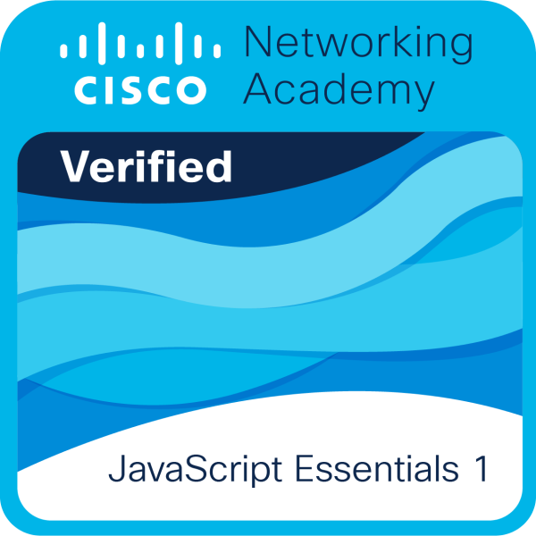

  
  <h1>Yashaswini Mudragadda</h1>
  <h3>🚀 Java Full Stack Developer | Frontend Enthusiast | UI/UX Learner</h3>

---
<h3 align="left">🛠️ Languages and Tools:</h3>
<table border="0">
  <tr style="background-color: #FFFDD0;">
    <td></td>
    <td>
    </td>
    <td></td>
    <td></td>
    <td></td>
    <td></td>
    <td></td>
    <td></td>
    <td></td>
    <td></td>
    <td></td>
    <td></td>
    <td></td>
    <td></td>
  </tr>
</table>

---

## 🍃 MongoDB & Database Design
*Transitioning from Relational to Document models and mastering Schema optimization.*

  
  
   
  <em>Focusing on the Bucket Pattern, Computed Patterns, and avoiding Unbounded Arrays.</em>

### 📜 Certifications & Learning
<table width="100%">
  <tr>
    <td align="center" width="50%">
       
      <strong>JavaScript Essentials</strong> 
      Core scripting for dynamic web logic.
    </td>
    <td align="center" width="50%">
       
      <strong>Postman API Fundamentals</strong> 
      API testing and workflow automation.
    </td>
  </tr>
</table>

---

## 📊 My Coding Dashboard

  
    
  

---

<h3 align="center" >Connect with me:</h3>

  
  

